# 智维通 · 进化批准落地专业方案

面向 **工业级** 交付：在保留 OpenCLAW 契约（无状态 Skill、仅 Event Bus、人工审核）的前提下，把「审计批准 → 元数据生效」做成 **可审计、可回滚、可自动化** 的流水线。

---

## 1. 目标与非目标

### 1.1 目标

- **可追溯**：任意一次生效的 `SkillExecution` / `SkillMeta` 变更，能关联到 `knowledge_doc_id`、审计 `correlation_id`、Git 提交、发布版本。
- **可回滚**：能在分钟级回到上一已知良好配置（同一 `skill_id`）。
- **可验证**：变更前后必须通过同一套 `validate` +（约定内的）沙盒/集成测试门禁。
- **可扩展**：单机 SQLite/Chroma 与多副本、Redis 总线并存时，方案不推倒重来。

### 1.2 非目标（当前阶段）

- 不做「无人参与」的自动合入生产（工业场景仍要 **人/流程门**）。
- 不强制替换现有「手工改 `.py`」路径，而是让 **手工路径与自动化路径并存**，由成熟度决定比例。

---

## 2. 现状与缺口（摘要）

| 环节 | 现状 | 缺口 |
|------|------|------|
| 错误聚合 | Orchestrator → `/system/errors` | 告警分级、采样、与工单系统对接（可选） |
| 进化提案 | EvolutionEngine → 沙盒 → 审核 command | 真 LLM 分析、历史用例库版本化 |
| 人工审核 | `gov_audit_review` → result + `/system/evolution/approved` | 与 IAM/工单绑定（可选） |
| 落地 | `EvolutionPromotion` → 知识库快照 + State 幂等 | **生效策略**（下文三种模式）未标准化 |
| 运维预览 | `promote-preview` CLI | **写回仓库/注册表**、CI 门禁、回滚脚本 |

---

## 3. 三种「元数据生效」模式（由易到难）

### 模式 A — **源码为真（GitOps）**（推荐作为默认工业路径）

- **含义**：批准后生成 **审阅稿**（已有 `promote-preview`），经人工或 PR 机器人 **合并进 `skills/**/*.py`**，打 Tag/发版。
- **优点**：审查友好、diff 清晰、与现有 Python 包模型一致、回滚 = revert commit。
- **缺点**：发布周期受代码评审约束（对工业是好事）。
- **配套**：`promote-preview -o` → PR 描述模板；CI 跑 `zhiweitong validate` + 约定沙盒。

### 模式 B — **注册表覆盖层（运行时）**

- **含义**：仓库内 `SkillMeta` 仍为「出厂默认」；进程启动或热更新时从 **DB/配置服务** 加载 `skill_id → SkillMeta 覆盖`，`get_skill` 返回「合并后」逻辑元数据。
- **优点**：紧急参数调整可不经发版（仍要审批与审计）。
- **缺点**：实现复杂度高；**必须与幂等键、版本号、缓存失效** 一起设计；多实例要一致存储。
- **适用**：成熟度高、有配置中心与审计平台之后。

### 模式 C — **侧车补丁文件（Repo 内、非主源码）**

- **含义**：例如 `config/meta_overrides/<skill_id>@<revision>.yaml`，启动时加载；Git 仍管理，但不动大块 Skill 源码。
- **介于 A/B**：比纯运行时多一层 Git 审计，比直接改 `.py` 冲突少。
- **缺点**：双源真相，需要代码生成或合并规则，文档成本高。

**建议顺序**：现阶段以 **模式 A** 为主；**模式 B** 仅在明确 SLA/运维需求时立项；**模式 C** 作为大型单体 Skill 文件的折中选项。

---

## 4. 推荐端到端流程（模式 A）

```mermaid
flowchart LR
  E[Orchestrator / errors] --> EV[EvolutionEngine]
  EV --> REV[/system/evolution/review + audit command/]
  REV --> AUD[AuditReviewSkill]
  AUD -->|approved| APP[/system/evolution/approved/]
  APP --> PRO[EvolutionPromotion]
  PRO --> KB[(Chroma snapshot)]
  KB --> CLI[promote-preview]
  CLI --> PR[PR / code review]
  PR --> CI[validate + sandbox gate]
  CI --> REL[Release tag]
```

1. **批准**：审计岗 `reviewer_decision=approve` → `EvolutionPromotion` 落库快照（已实现幂等）。
2. **预览**：运维/开发 `zhiweitong promote-preview --doc-id …` 生成 Markdown。
3. **合入**：按审阅稿改 `META.execution`（或整段 `META`，视 `--full-meta`），开 PR。
4. **门禁**：CI 执行 `validate` + 关键路径沙盒（覆盖率阈值按 `pyproject` / `CLAUDE.md` 策略）。
5. **发布**：版本号建议 **语义化**（见 §5）；打 Tag；生产按发布单滚动。

**拒绝路径**：`rejected` 已发 `/system/evolution/rejected`，建议在工单/日志平台记一条，无需进 promote 流水线。

---

## 5. 版本与标识（工业级最小集合）

| 标识 | 用途 |
|------|------|
| `knowledge_doc_id`（进化案例） | 链路到 Evolution 知识库正文 |
| `promotion` 快照 `doc_id` | CLI `promote-preview` 入口 |
| `audit_correlation_id` | 与人审会话对齐 |
| **Skill 业务版本** | 建议在 `SkillMeta` 增加可选 `revision: int` 或 `meta_revision`（需一次 schema 迁移讨论）；在模式 A 下也可用 **Git tag + 文件 hash** 代替直至定型 |

原则：**同一 `(skill_id, knowledge_doc_id, audit_correlation_id)` 只产生一次可生效快照**（已由 State 幂等保证）。

---

## 6. 安全与合规

- **总线**：`/system/evolution/*` 仅允许内网或 mTLS；订阅方白名单（Gateway、Promotion、未来自动化 worker）。
- **Chroma / SQLite**：文件权限、备份、恢复演练纳入运维 SOP。
- **密钥**：LLM、外部 API 仅用环境/密钥管理注入，不进快照 JSON。
- **审计**：保留 `EvolutionPromotion` State 行 + 知识库文档；生产可同步到 **只读审计库**（可选）。

---

## 7. 分阶段实施路线图（建议）

| 阶段 | 时长量级 | 内容 | 验收 |
|------|----------|------|------|
| **Phase A1** | 已完成基线 | `approved` 事件、Promotion 快照、`promote-preview` | 文档 + 测试 |
| **Phase A2** | 1–2 迭代 | **已实现**：`.github/workflows/ci.yml`（pytest + PR 内变更 `skills/**/*.py` 的 `zhiweitong validate --skip-sandbox`）、`.github/PULL_REQUEST_TEMPLATE.md`、`Makefile` 的 `validate-skills-diff`；建议仓库提交 **`poetry.lock`** 以锁定 CI 依赖 | CI 绿 + 模板字段齐备 |
| **Phase A3** | **已实现** | **`promote-apply`**：默认打印 unified diff；**`--write`** 写入前生成 **`*.promote-backup-<unix_ts>`**；仅替换 `META` 下 **`execution=SkillExecution(...)`** | 测试见 `tests/test_promote_apply.py`；回滚 = 备份文件或 `git checkout` |
| **Phase B** | 另立项 | 运行时覆盖层 + 配置中心 + 多实例一致性 | 压测与故障注入 |

---

## 8. 与「按手册扩岗」的关系

- **Phase 2 扩部门 Skill**：继续用手册 + `create-skill` / `batch-register`；每个 Skill **默认走模式 A** 进主分支。
- **进化**：不改变「一岗一文件」的常态；只增加 **偶发的元数据修订通道**，避免与批量扩岗混在同一套无纪律流程里。

---

## 9. 建议的下一步（执行项）

1. **固化 A2**：在 CI 增加 `zhiweitong validate`（对变更的 `skills/**/*.py` 做路径级 diff 触发）。  
2. **PR 模板**：链接 `promote-preview` 输出文件 + `doc_id` + `audit_correlation_id`。  
3. **运维一页纸**：`var/chroma` 与 `State` DB 的备份频率、恢复步骤、`promote-preview` 环境变量说明。  
4. ~~**（可选）A3**~~：**`promote-apply`** 已提供默认 diff + 可选 `--write` 与备份。

---

*本文与 `docs/handbook-gap-and-industrialization.md`、`docs/event_topics.md` 互补；契约变更须先改 `event_topics.md`。*
